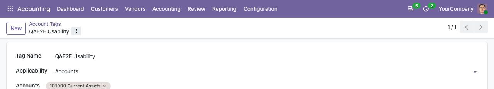

To link accounts to a tag:

1.  Go to *Accounting > Configuration > Accounting > Account Tags*.
2.  Create or open a tag with the applicability *Accounts*.
3.  In the accounts field, type the code or the name of an account and
    select it.
4.  Save: the tag is now set on the account.

To use Anglo-Saxon accounting or change the last day of the fiscal year,
go to *Accounting > Configuration > Settings*.
